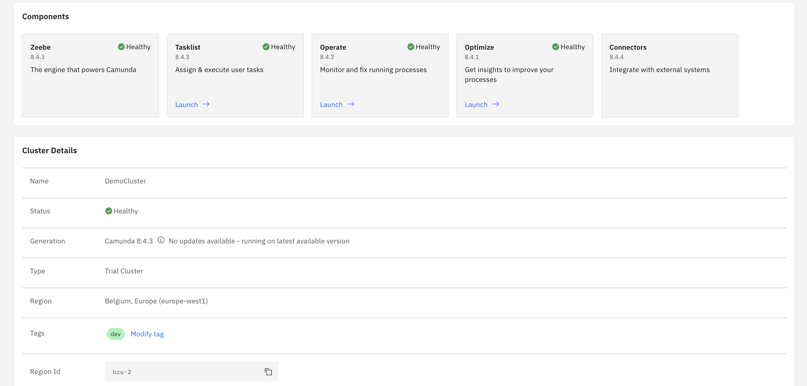
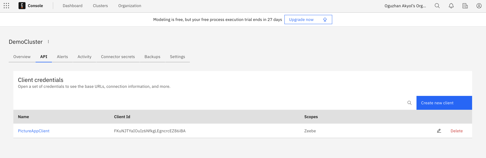
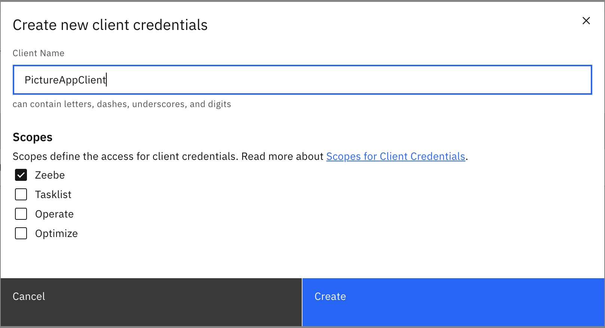
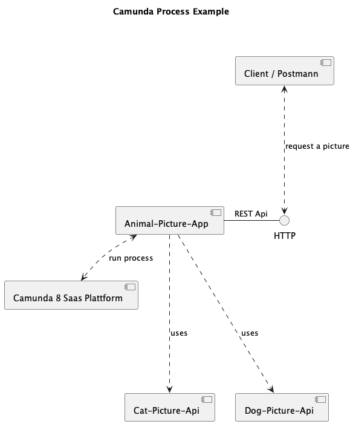
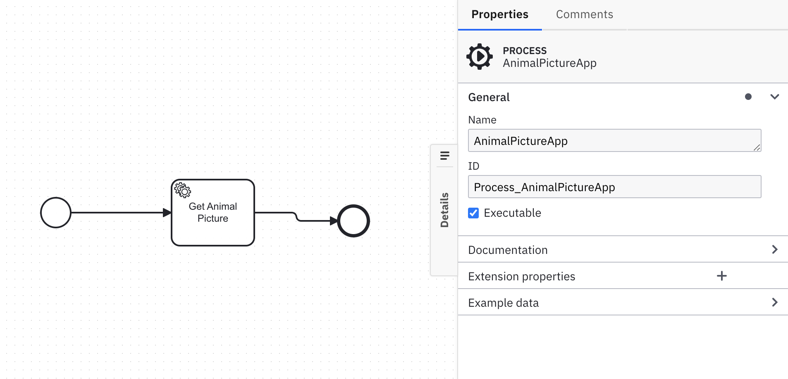
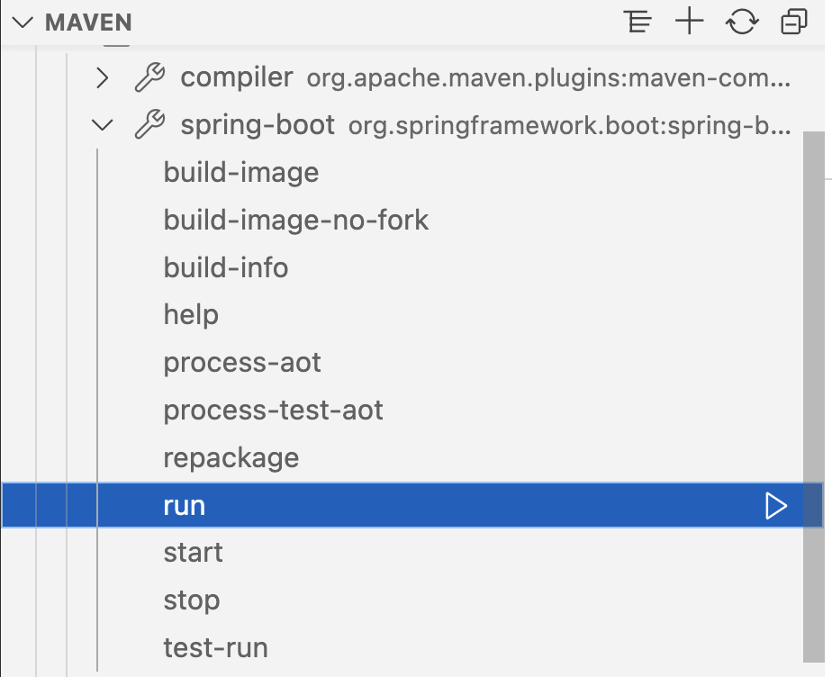
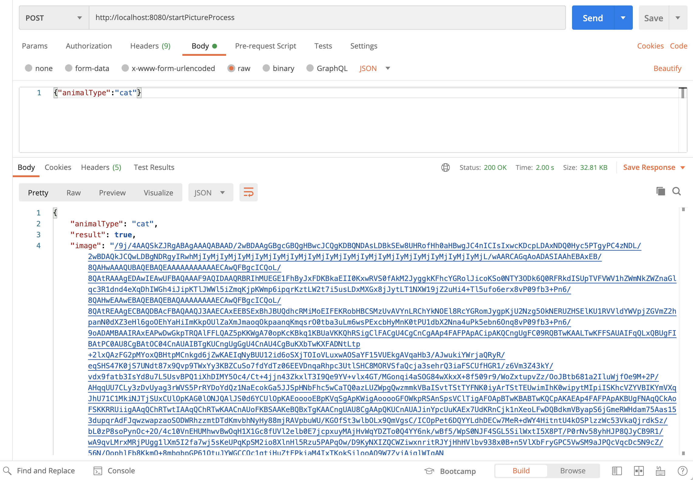

# Animal Picture App in Camunda-8

## Description

With this tutorial we are building a simple app to get a animal picture by given type of user. This version delivers a **cat** or **dog** picture to demonstrate the using diffrent external apis within the camunda process.

## Objectives

With this demo app you are going to learn following concepts:
- How to implement Zeebe JobWorker for Camunda 8 plattform
- How to run a process instance from a java client
- How to implement a process model in camunda 8 plattform
- How to implement a docker container for a java client within the camunda plattform
- How to implement a REST client in java with spring boot
- How to implement a REST server in java with spring boot
- How to use process variables in java client
- How to controll the process instance in java client


## Preconditions & Versions

```
➜  camundademo git:(main) ✗ java -version                                                                            
openjdk version "17.0.10" 2024-01-16
OpenJDK Runtime Environment Homebrew (build 17.0.10+0)
OpenJDK 64-Bit Server VM Homebrew (build 17.0.10+0, mixed mode, sharing)
```

```
➜  camundademo git:(main) ✗ mvn -v     
Apache Maven 3.9.6 (bc0240f3c744dd6b6ec2920b3cd08dcc295161ae)
```

```
➜  ~ docker -v
Docker version 25.0.3, build 4debf41
```

## Requirements


### Interfaces

For getting a cat picture we are going to use following API:

https://developers.thecatapi.com/view-account/ylX4blBYT9FaoVd6OhvR?report=bOoHBz-8t

Example request:
```
GET https://api.thecatapi.com/v1/images/search
```

Example Response (Array of Image Objects)
```
[{
"id":"ebv",
"url":"https://cdn2.thecatapi.com/images/ebv.jpg",
"width":176,"height":540,
"breeds":[],
"favourite":{}
}]
```

## Configurations in Camunda 8

Camunda Saas Offering to get started with the plattform, there is a 30-day free trial without any cost. Please sign up for a trial account if you dont have:
camunda.io/signup

Please create a demo trial cluster in camunda plattform with following the steps in this tutorial: 
https://camunda.com/blog/2019/09/getting-started-camunda-cloud/

Our Cluster name is configured as "DemoCluster" in Camunda version 8.4.3.



To be able to access as a Client to the camunda plattform we need to configure API client in camunda console.

Please go to the console in your cluster and create a new client for Zeebee access.







Please keep the client credentials copied before closing the settings in API console. These settings we need to copy to application.properties in our client app project. Spring Boot recognises the settings in the properties file automaticly. After coping these, you will be able to access the Camunda to do expected tasks from external client.

## Architecture

In the following context diagram is the implemented architecture overview.




## Process model





## Process Examples

http://localhost:8080/startPictureProcess

```
{"animalType":"cat"}
```

```
{"animalType":"dog"}
```

### Settings

```
# Cloud connection settings

zeebe.client.cloud.region=bru-2
zeebe.client.cloud.clusterId=8217fee2-b757-44c0-ba81-4d08d5ed31f2
zeebe.client.cloud.clientId=FKuNJTYaIOuIz6NfkgLEgncrcEZ86iBA
zeebe.client.cloud.clientSecret=XXXXXXXXXXXXXXXX
```


```
BPMN_PROCESS_ID = "Process_AnimalPictureApp"
```

## Building

### Fot local tests
We are using for building an packaging maven. Please run the following command in a terminal window (in the complete) directory:

```
./mvnw spring-boot:run
```


### For running in container

```
docker build --pull --rm -f "Dockerfile" -t camundademo:latest "." 
```

```
docker run -d -p 8080:8080 --name camundademo camundademo:latest
```

## Testing

Example request:
```
{"animalType":"cat"}
```

Example response:
```
{
    "animalType": "cat",
    "result": true,
    "image": "/9j/4AAQSkZJRgABAgAAAQABAAD/2wBDAAgGBgcGBQgHBwcJCQgKDBQNDAsLDBkSEw8UHRofHh0aHBwgJC4nICIsIxwcKDcpLDAxNDQ0Hyc5PTgyPC4zNDL/2wBDAQkJCQwLDBgNDRgyIRwhMjIyMjIyMjIyMjIyMjIyMjIyMjIyMjIyMjIyMjIyMjIyMjIyMjIyMjIyMjIyMjIyMjL/wAARCAGqAoADASIAAhEBAxEB/...."
}    
```



#### Usefull links

- Onboarding for camunda 8: https://github.com/camunda/camunda-platform-get-started
- Very good process examples from community: https://github.com/camunda-community-hub/camunda-8-process-solution-template
- Zeebe Client implementation example: https://github.com/camunda-community-hub/spring-zeebe
- API Client implementation example:  https://docs.camunda.io/docs/apis-tools/build-your-own-client/
- Spring boot REST Client implementation: https://howtodoinjava.com/spring/spring-restclient/
- For testing purposes, there are some supporting libraries available for example Java: https://github.com/camunda/zeebe-process-test
- Postman collection: https://www.postman.com/camundateam
- Interacting with the Process Engine (=Zeebe) is done via a gRPC API. For more details on that API please see: https://docs.camunda.io/docs/apis-tools/grpc/
- A “Job-Worker” is a piece of software that interacts with the Process Engine (= Zeebe) directly, more details on the Job-Workers: https://docs.camunda.io/docs/components/concepts/job-workers/
- Usefull examples for camunda-8: https://github.com/camunda-community-hub/camunda-8-examples