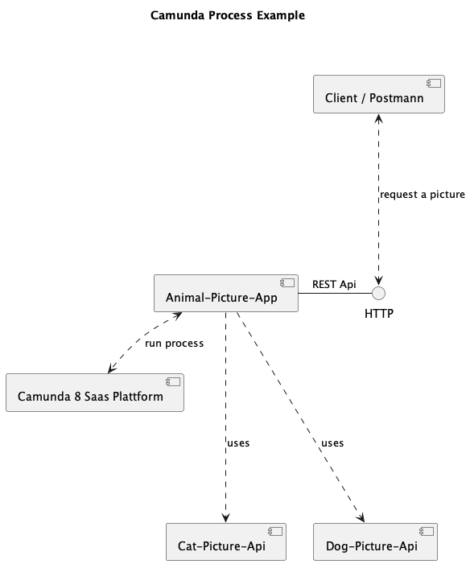

# Animal Picture App in Camunda-8

## Description

With this tutorial we are building a simple app to get a animal picture by given type of user. This version delivers a **cat** or **dog** picture to demonstrate the using diffrent external apis within the camunda process.

## Objectives

With this demo app you are going to learn following concepts:
- How to implement Zeebe JobWorker for Camunda 8 plattform
- How to run a process instance from a java client
- How to implement a process model in camunda 8 plattform
- How to implement a docker container for a java client within the camunda plattform
- How to implement a REST client in java with spring boot
- How to implement a REST server in java with spring boot
- How to use process variables in java client
- How to controll the process instance in java client
- How does the test container works and a test process automated
- How to build a spring boot container with maven


## Tools & Versions

Please install the required tools with versions.

```
# java -version                                                                            
openjdk version "17.0.10" 2024-01-16
OpenJDK Runtime Environment Homebrew (build 17.0.10+0)
OpenJDK 64-Bit Server VM Homebrew (build 17.0.10+0, mixed mode, sharing)
```

```
# mvn -v     
Apache Maven 3.9.6 (bc0240f3c744dd6b6ec2920b3cd08dcc295161ae)
```

```
# docker -v
Docker version 25.0.3, build 4debf41
```

- Docker Desktop
- IntelliJ or Visual Studio code

## Requirements

The App uses JSON Protocol for communication. To have a standard way of interfaces we have choosen some example apis with JSON Format.

### Interfaces

For getting a cat picture we are going to use following API:

https://developers.thecatapi.com/view-account/ylX4blBYT9FaoVd6OhvR?report=bOoHBz-8t

Example request:
```
GET https://api.thecatapi.com/v1/images/search
```

Example Response (Array of Image Objects)
```
[{
"id":"ebv",
"url":"https://cdn2.thecatapi.com/images/ebv.jpg",
"width":176,"height":540,
"breeds":[],
"favourite":{}
}]
```
For getting a dog picture we are going to use following API:

```
GET https://dog.ceo/api/breeds/image/random
```

```
{
    "message":"https://images.dog.ceo/breeds/terrier-norwich/n02094258_1805.jpg",
    "status":"success"
}
```

### REST interface of app

The app servs the clients with REST interface like following endpoint:
http://localhost:8080/startPictureProcess

We are going to define our request interface like following format:
For requesting the cat pictures:
```
{"animalType":"cat"}
```
Or for requesting the dog pictures:
```
{"animalType":"dog"}
```

## Configurations in Camunda 8

Camunda Saas Offering to get started with the plattform, there is a 30-day free trial without any cost. Please sign up for a trial account if you dont have:
camunda.io/signup

Please create a demo trial cluster in camunda plattform with following the steps in this tutorial: 
https://camunda.com/blog/2019/09/getting-started-camunda-cloud/

Our Cluster name is configured as "DemoCluster" in Camunda version 8.4.3.


To be able to access as a Client to the camunda plattform we need to configure API client in camunda console.

Please go to the console in your cluster and create a new client for Zeebee access.


Please keep the client credentials copied before closing the settings in API console. These settings we need to copy to application.properties in our client app project. Spring Boot recognises the settings in the properties file automaticly. After coping these, you will be able to access the Camunda to do expected tasks from external client.

## Architecture

In the following context diagram is the implemented architecture overview.



Here are the compenents:
- Camunda 8 plattform
- Animal-Picture-App (our demo project)
- Cat-Picture-API (external)
- Dog-Picture-API (external)
- Postman as client tool to test our app

## Process model

Here we are implementing a simple process model with a single service task. 


For the service task we are going to define a static ID to be able to acces it programmaticly later. Please pay attention to change the ID if you would like to use this code in your project.

```
BPMN_PROCESS_ID = "Process_AnimalPictureApp"
```


### Settings

Please consider following settings if your have configured your own cluster in camunda 8 plattform.

```
# Cloud connection settings

zeebe.client.cloud.region=bru-2
zeebe.client.cloud.clusterId=8217fee2-b757-44c0-ba81-4d08d5ed31f2
zeebe.client.cloud.clientId=FKuNJTYaIOuIz6NfkgLEgncrcEZ86iBA
zeebe.client.cloud.clientSecret=XXXXXXXXXXXXXXXX
```
Spring boot helps us the configuration of services automaticly with only this properties settings.


## Building

We are going to use spring boot maven plugins for packing a complet executable JAR package. This JAR will includes all dependencies and can be executable in container without any external dependencies. After buildding the it will be a standalome image with docker build. 

### For local tests
We are using for building an packaging maven. 
```
mvn clean install
```

Please run the following command after packing in a terminal window (in the complete) directory:

```
./mvnw spring-boot:run
```


### For running in container

If you want to test the app within the container then please follow the next steps:

```
docker build --pull --rm -f "Dockerfile" -t camundademo:latest "." 
```
This will build a "camundademo" image and tag it with latest version. For running the image as container please use run command and define the usable free ports in your host machie like 8080.

```
docker run -d -p 8080:8080 --name camundademo camundademo:latest
```

After running the container the application will be availbe with following endpoint for testing:
http://localhost:8080/startPictureProcess


## Testing

### Manual testing

Please use following examples with Postman as a client tool for testing.

Example request:
```
{"animalType":"cat"}
```

Example response:
```
{
    "animalType": "cat",
    "result": true,
    "image": "/9j/4AAQSkZJRgABAgAAAQABAAD/2wBDAAgGBgcGBQgHBwcJCQgKDBQNDAsLDBkSEw8UHRofHh0aHBwgJC4nICIsIxwcKDcpLDAxNDQ0Hyc5PTgyPC4zNDL/2wBDAQkJCQwLDBgNDRgyIRwhMjIyMjIyMjIyMjIyMjIyMjIyMjIyMjIyMjIyMjIyMjIyMjIyMjIyMjIyMjIyMjIyMjL/wAARCAGqAoADASIAAhEBAxEB/...."
}    
```


### Automated Testing

ZeeBe Framework allows us implementing test automations in java within a container.
This concept will deploy a test container automaticly with the test process. Test automation example can be seen in following java class:
https://github.com/akyolog/camundademo/blob/main/src/test/java/com/camunda/demo/pictureapp/PictureappContainerTest.java

If you are running the maven tasks in locall machiene the test will be executed automaticly
```
mvn test or mvn package
```

#### Usefull links

- Onboarding for camunda 8: https://github.com/camunda/camunda-platform-get-started
- Very good process examples from community: https://github.com/camunda-community-hub/camunda-8-process-solution-template
- Zeebe Client implementation example: https://github.com/camunda-community-hub/spring-zeebe
- API Client implementation example:  https://docs.camunda.io/docs/apis-tools/build-your-own-client/
- Spring boot REST Client implementation: https://howtodoinjava.com/spring/spring-restclient/
- For testing purposes, there are some supporting libraries available for example Java: https://github.com/camunda/zeebe-process-test
- Postman collection: https://www.postman.com/camundateam
- Interacting with the Process Engine (=Zeebe) is done via a gRPC API. For more details on that API please see: https://docs.camunda.io/docs/apis-tools/grpc/
- A “Job-Worker” is a piece of software that interacts with the Process Engine (= Zeebe) directly, more details on the Job-Workers: https://docs.camunda.io/docs/components/concepts/job-workers/
- Usefull examples for camunda-8: https://github.com/camunda-community-hub/camunda-8-examples